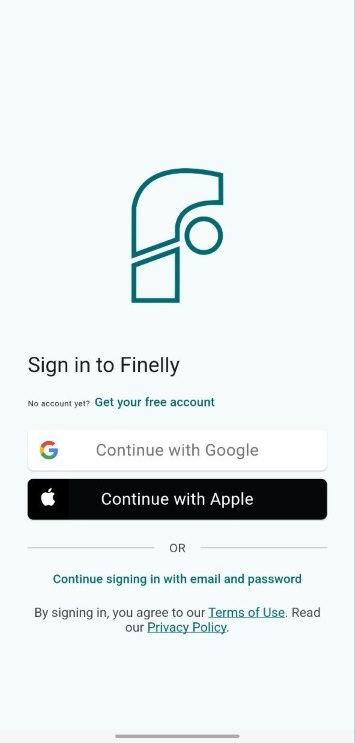
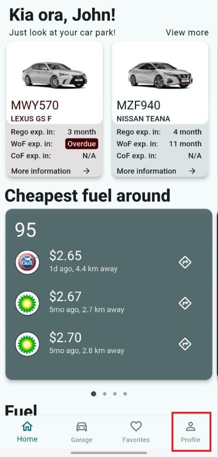
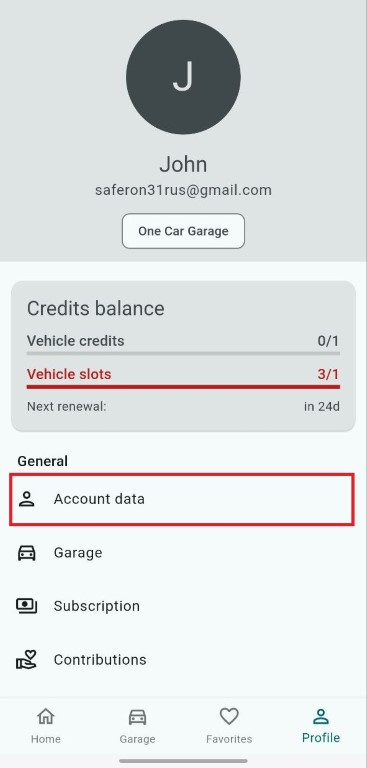

# Finelly Provider Set Up

## Background

Finelly integration requires a user ID in order to provide fuel prices.

## Retrieving Your User ID

1. **Install the Finelly app** from the [App Store](https://apps.apple.com/nz/app/finelly/id6478907591) or [Google Play Store](https://play.google.com/store/apps/details?id=com.finelly.finelly&hl=en), if you have not already.

1. **Open the app**.

1. **Sign in / Sign up** to the app in the most convenient way for you: using Google, Apple accounts, or email and password.
\

1. **Now you are on the home screen**.
1. **Tap on the Profile menu item** in the bottom navigation bar.
\

1. **Select Account Data**.
\

1. **Long press on your User ID** and copy it.
\

1. **Paste your User ID** during the integration set up.

You are done!
